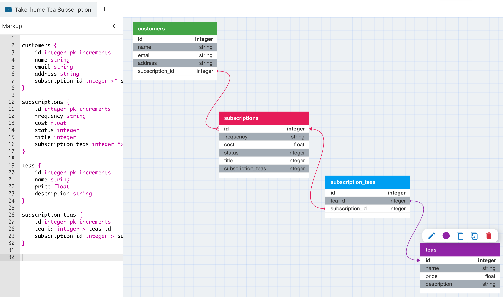

# README

## Introduction

This Rails API is a simulation of a tea subscription service that allows a customer to create a subscription, cancel a subscription, and see all subscriptions that belong to them, both active and inactive. 

## Set-Up

1. Fork this repository and clone it to your local machine in the directory it belongs. 
2. `cd` into the directory and run `bundle install` from the command line. 
3. To set up the database run:
```
rails db:{drop,create,migrate,seed}
```

## Tech Stack
  
<div align="center">  
    <a href="https://www.postgresql.org/" target="_blank"></a>  
    <a href="https://rubyonrails.org/" target="_blank"></a>  
    <a href="https://www.ruby-lang.org/en/" target="_blank"></a>   
</div>

## Database
This API stores data in a PostgreSQL database with four tables, `customers`, `subscriptions`, `subscription_teas` and `teas`. In this relational database, customers have many subscriptions and subscriptions belong to a single customer. A 
many-to-many relationship exists between subscriptions and teas via the joins table `subscription_teas`.



## Endpoints
In order to hit the endpoints this exposes, you'll need to spin up a server for it somewhere. It's not currently hosted anywhere. As such, only the URIs for the endpoints are listed.
The endpoints for this API are as follows: 

#### Subscriptions Index: 

```
GET /api/v1/customers/:customer_id/subscriptions
```
This endpoint returns JSON for every subscription that belongs to a customer, active and inactive. 

  ```
    {
    "data": [
        {
            "id": "1",
            "type": "subscription",
            "attributes": {
                "frequency": "weekly",
                "status": "active",
                "title": "Daydream",
                "customer_id": 1,
                "created_at": "2023-09-12T21:37:52.510Z",
                "updated_at": "2023-09-12T21:37:52.510Z",
                "cost": 78.62,
                "teas": [
                    {
                        "id": 2,
                        "name": "Neem",
                        "price": 63.53,
                        "description": "a mellow, fruity blend",
                        "created_at": "2023-09-12T21:37:52.471Z",
                        "updated_at": "2023-09-12T21:37:52.471Z"
                    },
                    {
                        "id": 3,
                        "name": "Boldo",
                        "price": 15.09,
                        "description": "An herbal tea, take for an upset tummy",
                        "created_at": "2023-09-12T21:37:52.473Z",
                        "updated_at": "2023-09-12T21:37:52.473Z"
                    }
                ]
            }
        },
        {
            "id": "2",
            "type": "subscription",
            "attributes": {
                "frequency": "monthly",
                "status": "inactive",
                "title": "Faith",
                "customer_id": 1,
                "created_at": "2023-09-12T21:37:52.518Z",
                "updated_at": "2023-09-12T21:37:52.518Z",
                "cost": 127.06,
                "teas": [
                    {
                        "id": 2,
                        "name": "Neem",
                        "price": 63.53,
                        "description": "Single origin, loose-leaf tea",
                        "created_at": "2023-09-12T21:37:52.471Z",
                        "updated_at": "2023-09-12T21:37:52.471Z"
                    },
                    {
                        "id": 2,
                        "name": "Neem",
                        "price": 63.53,
                        "description": "Single origin, loose-leaf tea",
                        "created_at": "2023-09-12T21:37:52.471Z",
                        "updated_at": "2023-09-12T21:37:52.471Z"
                    }
                ]
            }
        },
        {
            "id": "3",
            "type": "subscription",
            "attributes": {
                "frequency": "fortnightly",
                "status": "active",
                "title": "Teas Are Really Great",
                "customer_id": 1,
                "created_at": "2023-09-12T21:38:07.374Z",
                "updated_at": "2023-09-12T21:38:07.374Z",
                "cost": 63.53,
                "teas": [
                    {
                        "id": 2,
                        "name": "Neem",
                        "price": 63.53,
                        "description": "Single origin, loose-leaf tea",
                        "created_at": "2023-09-12T21:37:52.471Z",
                        "updated_at": "2023-09-12T21:37:52.471Z"
                    }
                ]
            }
        }
    ]
}
```

#### Subscription Cancellation:
In order to cancel a tea subscription, make a patch request with the query parameter `status=inactive` to the following endpoint: 

```
PATCH /api/v1/customers/:customer_id/subscriptions/:subscription_id?status=inactive
```
This will return a JSON object for the updated subscription record. 

#### Subscription Creation:
To create a new subscription, the following info must be passed in the request body as a JSON payload: 

```
{
  "title": "Teas Are Really Great",
  "frequency": "fortnightly",
  "teas":
    [{"id": 2,
      "name": "Moringa",
      "price": 10.08,
      "description": 
        "Earthy, loose-leaf herbal tea, good for lowering inflamation",
      "created_at": "2023-09-12T21:20:53.397Z",
      "updated_at": "2023-09-12T21:20:53.397Z"}, 
      {"id": 2,
        "name": "Neem",
        "price": 63.53,
        "description": "Single origin, loose-leaf tea",
        "created_at": "2023-09-12T21:37:52.471Z",
        "updated_at": "2023-09-12T21:37:52.471Z"
      }]
}
```
Teas must already exist in the database to be added to a subscription at creation.

Succesful creation returns the subscription created thus: 
```
{
    "data": {
        "id": "3",
        "type": "subscription",
        "attributes": {
            "frequency": "fortnightly",
            "status": "active",
            "title": "Teas Are Really Great",
            "customer_id": 1,
            "created_at": "2023-09-12T21:38:07.374Z",
            "updated_at": "2023-09-12T21:38:07.374Z",
            "cost": 73.61,
            "teas":
                  [{"id": 2,
                    "name": "Moringa",
                    "price": 10.08,
                    "description": 
                      "Earthy, loose-leaf herbal tea, good for lowering inflamation",
                    "created_at": "2023-09-12T21:20:53.397Z",
                    "updated_at": "2023-09-12T21:20:53.397Z"}, 
                    {"id": 2,
                      "name": "Neem",
                      "price": 63.53,
                      "description": "Single origin, loose-leaf tea",
                      "created_at": "2023-09-12T21:37:52.471Z",
                      "updated_at": "2023-09-12T21:37:52.471Z"
                    }]
        }
    }
}
```

Unsuccessful creation occurs when either `"title"` or `"frequency"` are missing from the request body and validations fail. Expect to see an error returned thus:
```
{
    "error": {
        "status": 422,
        "message": "Validation failed: <attibute> can't be blank"
    }
}
```